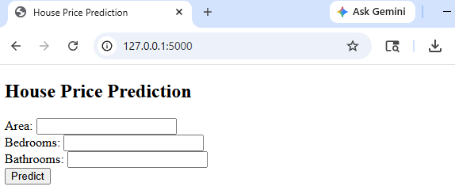
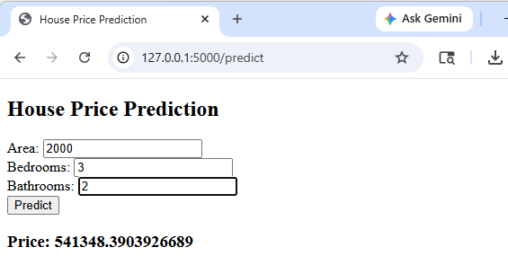

# House Price Prediction using Machine Learning

Live Demo: https://your-app-link.onrender.com

## Project Overview

This project predicts house prices based on various features such as **area, location, number of bedrooms, bathrooms, and building type** using **regression techniques**.
It also includes a **web application** where users can input details and get predicted prices instantly.

---

## Features

* Predict house prices using ML model
* Regression-based prediction (Linear Regression / Advanced models)
* User-friendly web interface using Flask
* Supports multiple features like area, zones, house type
* Real-time prediction

---

## Tech Stack

* **Programming Language:** Python
* **Libraries:** Pandas, NumPy, Scikit-learn
* **Framework:** Flask
* **Frontend:** HTML, CSS
* **Version Control:** Git & GitHub

---

## Project Structure

```
House-Price-Prediction/
│── data/
│   └── house_data.csv
│
│── model/
│   └── train_model.py
│
│── app/
│   ├── app.py
│   └── model.pkl
│   └── templates/
│       └── index.html
│
│── requirements.txt
│── README.md
```

---

## Dataset

* The dataset contains:

  * Area (sq ft)
  * Number of bedrooms
  * Number of bathrooms
  * Location / Zone
  * Price (target variable)

*(You can use Kaggle datasets or custom datasets)*

---

## Installation & Setup

### 1 Clone the repository

```bash
git clone https://github.com/Amrutha3690/house-price-prediction.git
cd house-price-prediction
```

### 2 Install dependencies

```bash
pip install -r requirements.txt
```

### 3️ Train the model

```bash
cd model
python train_model.py
```

### 4️ Run the application

```bash
cd ../app
python app.py
```

### 5️ Open in browser

```
http://127.0.0.1:5000/
```

---

## Deployment

The project can be deployed using platforms like:

* Render
* Railway
* Heroku (if available)

---

## Screenshots

### 🔹 Web Interface UI


### 🔹 Web Interface Result


---

## 🎯 Learning Outcomes

* Implemented regression models for real-world prediction
* Built end-to-end ML project (data → model → deployment)
* Learned Flask web integration
* Understood GitHub project structuring

---

## 👩‍💻 Author

**Amrutha R V Uppuganti** 
B.Tech CSE (Data Science)

---
